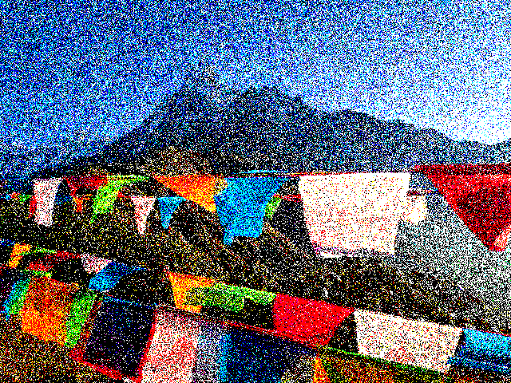
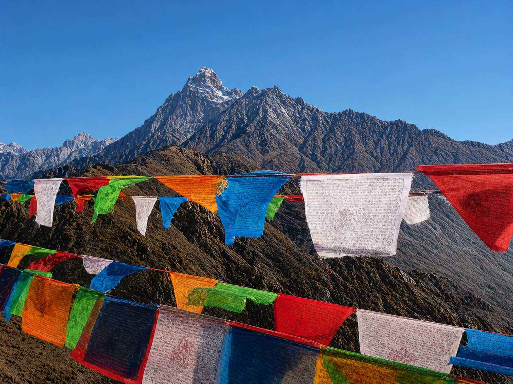
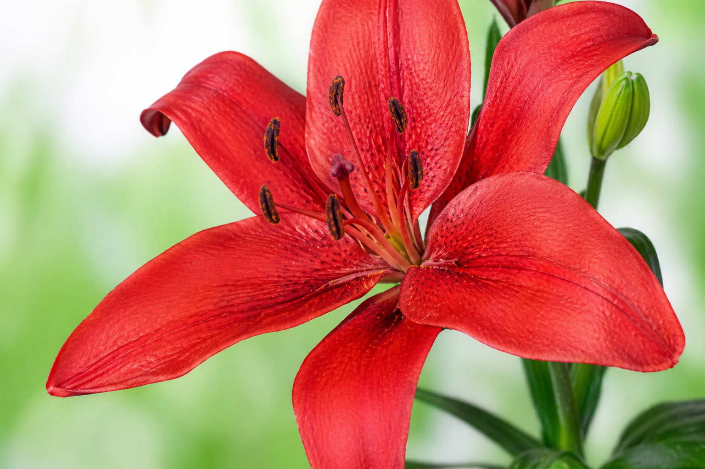
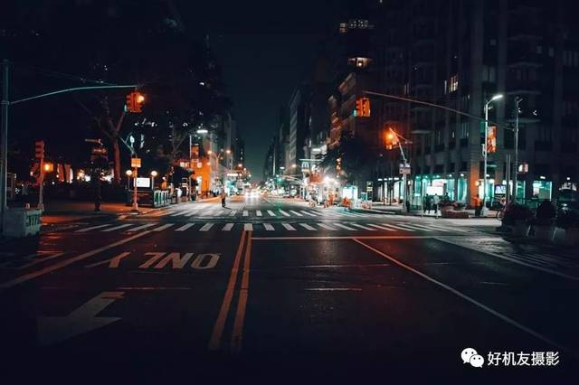
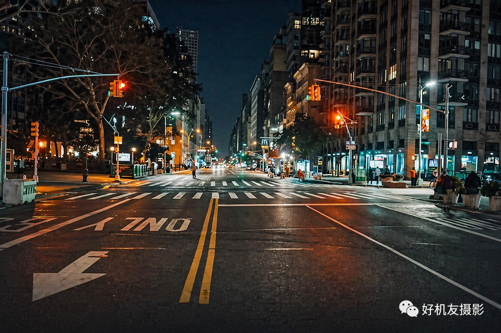
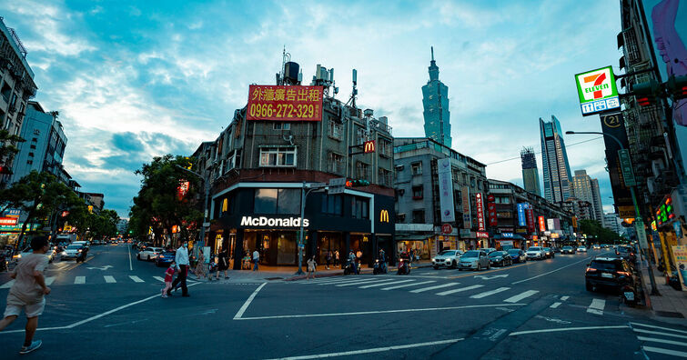
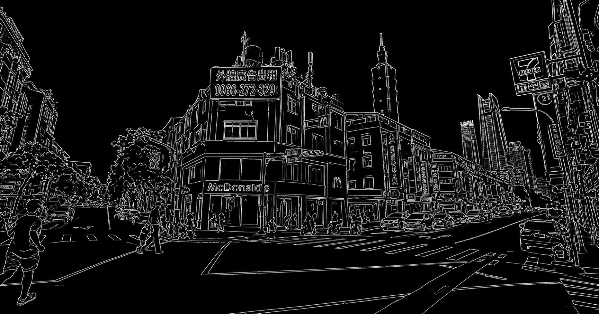
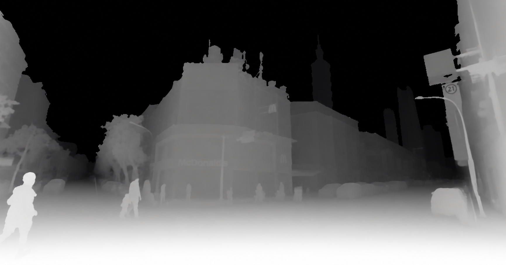
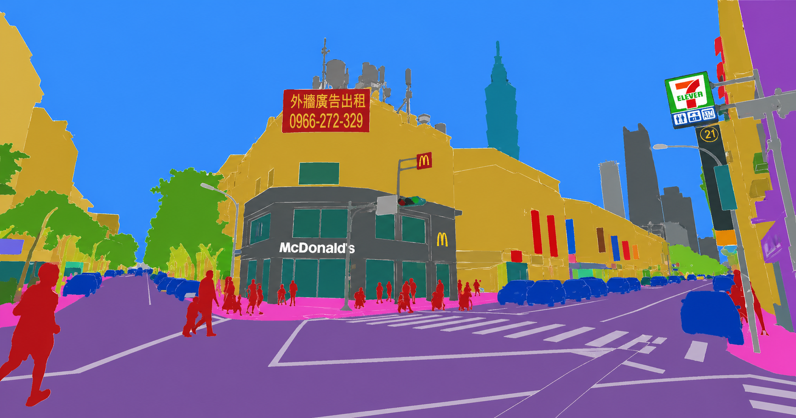

# Low-Level Vision P2P Skill (GPT-Image)

Language: **English** | [中文](./README.zh-CN.md)

Turn one input image into task-specific low-level vision outputs with a single task name.

This repository provides:
- A production-ready Cursor Skill for image-to-image low-level/pixel-to-pixel transforms
- A standardized task taxonomy and prompt contract
- A runnable automation script powered by frontier image models (`gpt-image-2` by default)
- A demo gallery layout you can quickly fill with your own results
- A batch runner for fast multi-task showcase generation
- Cross-IDE integration docs (Cursor, Claude-style workflows, and generic IDE terminals)

## Why this is useful

- **Unified interface**: one `--input` + one `--task`
- **Prompt quality control**: consistent hard constraints to reduce hallucination
- **Reproducibility**: output metadata captures full prompt + model + size
- **Publish-friendly**: includes skill files and gallery structure for GitHub showcase

## Supported task families

- Restoration: denoise, deblur, super-resolution, dehaze, derain, low-light enhancement, artifact removal, etc.
- Dense map outputs: edge maps, depth maps, normal maps, saliency, masks, segmentation-like maps
- Intrinsic decomposition: albedo layer and shading layer
- Geometry-preserving transforms: rectification, structural inpainting, local outpainting
- Domain translation (pixel-aligned preference): photo/sketch, map/satellite-like

Full list lives in:
- `.cursor/skills/low-level-vision-p2p/SKILL.md`

<details>
<summary><strong>Supported low-level vision tasks (click to expand)</strong></summary>

### Restoration

- `denoise`: remove sensor/chroma noise while preserving textures
- `deblur`: recover sharp details from motion/defocus blur
- `super_resolution`: improve apparent resolution with structure consistency
- `jpeg_artifact_removal`: remove blocking/ringing from compression
- `dehaze`: reduce haze/fog and restore natural contrast
- `derain`: remove rain streaks and rain veil
- `deweather`: clean mixed weather artifacts (rain/snow/fog)
- `low_light_enhance`: improve dark visibility with controlled noise
- `color_correction`: correct global/local color cast
- `white_balance`: neutralize illumination color bias
- `exposure_correction`: rebalance highlight and shadow details
- `lens_distortion_correction`: correct barrel/pincushion distortion
- `vignette_removal`: remove corner darkening
- `reflection_removal`: suppress glass/specular reflections
- `shadow_removal`: reduce cast shadows with material consistency
- `moire_removal`: suppress moire/interference patterns

### Color and Tone Mapping

- `grayscale_to_color`: plausible colorization from grayscale input
- `day_to_night`: convert daytime appearance to nighttime style
- `night_to_day`: convert nighttime scene to daytime appearance
- `style_preserving_relight`: change illumination while preserving geometry/identity
- `hdr_like_tone_mapping`: improve local dynamic range perception

### Geometry and View-Preserving

- `rectification`: perspective correction for documents/buildings
- `inpainting_structural`: fill missing regions using local structure cues
- `outpainting_local_context`: extend image context with continuity

### Dense Prediction-Style Outputs

- `edge_map`: white-on-black edge visualization
- `line_art_clean`: clean contour-focused line drawing
- `depth_map`: relative depth map (near bright, far dark)
- `albedo_layer`: intrinsic reflectance/albedo decomposition output
- `shading_layer`: intrinsic shading/illumination decomposition output
- `surface_normals`: RGB surface normal map
- `saliency_map`: attention/saliency intensity map
- `binary_mask_foreground`: foreground white / background black mask
- `semantic_segmentation_map`: color-coded semantic region map

### Domain Translation (Pixel-Aligned Preference)

- `photo_to_sketch`: convert photo to structure-preserving sketch
- `sketch_to_photo`: render sketch into realistic photo
- `map_to_satellite_like`: map-style to satellite-like appearance
- `satellite_like_to_map`: satellite-like to map-style rendering
- `thermal_like_render`: thermal-camera-like visualization

</details>

## Quick start

### 1) Install dependencies

```bash
python -m venv .venv
source .venv/bin/activate
pip install openai pillow
```

### 2) Set API key

```bash
export OPENAI_API_KEY="your_key_here"
```

### 3) Run one task

```bash
python .cursor/skills/low-level-vision-p2p/scripts/run_task.py \
  --input demos/input/example.jpg \
  --task dehaze \
  --model gpt-image-2 \
  --size 1024x1024
```

Generated files:
- `outputs/dehaze/example__dehaze.png`
- `outputs/dehaze/example__dehaze.json`

### 4) Run a demo batch

```bash
python .cursor/skills/low-level-vision-p2p/scripts/run_batch.py \
  --manifest demos/tasks.example.json \
  --model gpt-image-2 \
  --size 1024x1024
```

## IDE compatibility

| IDE / Agent | Status | How to use |
|---|---|---|
| Cursor | Ready | Native skill in `.cursor/skills/low-level-vision-p2p/` |
| Claude-style IDE workflows | Ready | Use adapter docs in `adapters/claude/` and call shared CLI |
| VS Code | Ready | Use `adapters/vscode/tasks.json.example` |
| Other IDEs | Ready | Run CLI directly from terminal/tasks |

Integration docs:
- `docs/IDE_INTEGRATION.md`
- `adapters/claude/SKILL.md`
- `adapters/claude/PROMPT_TEMPLATE.md`
- `adapters/vscode/README.md`
- `adapters/vscode/tasks.json.example`

## Gallery preview

### Denoise

<table>
  <tr>
    <th>Input</th>
    <th>Output</th>
  </tr>
  <tr>
    <td></td>
    <td></td>
  </tr>
</table>

### Deblur

<table>
  <tr>
    <th>Input</th>
    <th>Output</th>
  </tr>
  <tr>
    <td></td>
    <td></td>
  </tr>
</table>

### Low-light Enhance

<table>
  <tr>
    <th>Input</th>
    <th>Output</th>
  </tr>
  <tr>
    <td></td>
    <td></td>
  </tr>
</table>

### Edge Map

<table>
  <tr>
    <th>Input</th>
    <th>Output</th>
  </tr>
  <tr>
    <td></td>
    <td></td>
  </tr>
</table>

### Depth Map

<table>
  <tr>
    <th>Input</th>
    <th>Output</th>
  </tr>
  <tr>
    <td></td>
    <td></td>
  </tr>
</table>

### Semantic Segmentation Map

<table>
  <tr>
    <th>Input</th>
    <th>Output</th>
  </tr>
  <tr>
    <td></td>
    <td></td>
  </tr>
</table>

## Skill trigger examples

The skill should activate when user asks things like:
- "把这张图做去噪"
- "use this image to generate a depth map"
- "do pixel-to-pixel dehaze from this input"
- "turn this photo into clean line art"

## Repository structure

```text
.cursor/skills/low-level-vision-p2p/
  SKILL.md
  reference.md
  examples.md
  scripts/run_task.py
demos/
  input/
  gallery/
outputs/
```

